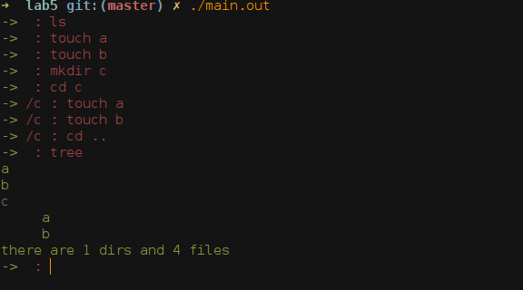
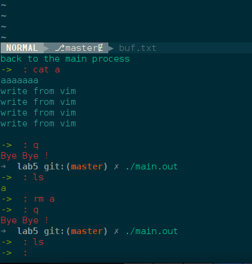

# Hust OS Lab
Because the lab5 is a little more complex, so I show some details about it
aspecting to how it works and the ideas behind it.

## How it works

### Adding and Deleting

The picture as show below, after launch the program, you can use `ls` to show files and directories,  `mkdir` to create directories,  `touch` to show create files and so on.



### Integrating Vim

Vim is  essential for IO, but implementing a toy vim is distraction.



## How to build it

### Manage free inodes
Using linked list and root node keeps the next free inode num.
### Manage free blocks
### Integrate Vim
Here is the core code. **execvp** and **wait** are the only two key function.
```
    printf("start vim !\n");
    char * args[] = {"vim", VIM_BUF_PATH, NULL};
    int status;
    if(!fork()){
        execvp("vim", args);
    }
    wait(&status);
    printf("back to the main process\n");


    buf = fopen(VIM_BUF_PATH, "rb");
    fseek(buf, 0, SEEK_END);
    long fsize = ftell(buf);
    fseek(buf, 0, SEEK_SET);
    contend = (char *)malloc(fsize + 1);
    fread(contend, fsize, 1, buf);
    fclose(buf);
    contend[fsize] = '\0';

    clear(f);

    if(DEBUG_APP) printf("从buf.txt 中间 向 该文件 写入数据长度为%lu\n", fsize + 1);
    write_file(contend, sizeof(char), fsize + 1, f);
    save_inode(f);

```
